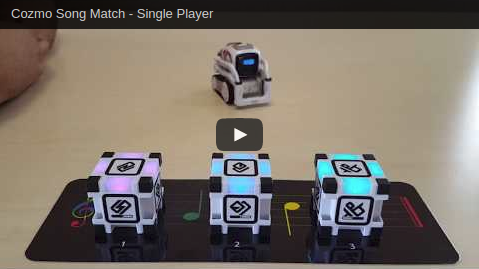

# Song Match

A game where you match the notes of a song by tapping blocks with Cozmo.

You can view our documentation at http://cozmo-song-match.readthedocs.io/en/latest/.

## How does it work?
Take for example the song *Mary had a Little Lamb*.

When the game is first launched, it will ask for the number of players. The game supports up to three players (four players if you include Cozmo). Next, the game starts the first round by playing the first three notes of a song. Each time a note is played, a corresponding cube flashes and musical note will play from the computer's speakers. The player must match the notes by tapping the correct sequence of cubes as if they were piano keys. After the player's turn, then Cozmo tries to match the correct sequence. If either the player(s) or Cozmo gets three notes incorrect, then they lose the game.

This makes up one round. Each round the length of the sequence increases, until you reach the end of the song.

If the player makes it to the end of the song without getting three notes incorrect, they will be victorious and win the game. There can be multiple winners (including Cozmo). When the song ends, Cozmo will announce the winners and the song will be played in it’s entirety to wrap up the game. 

## How to Run
Please see [Setup](http://cozmo-song-match.readthedocs.io/en/latest/pages/setup.html) under our documentation.
