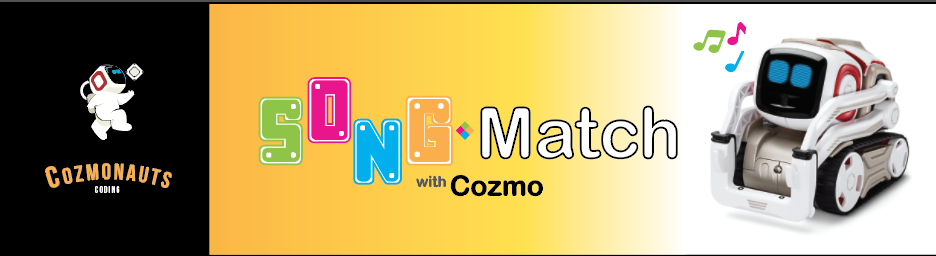

.. Song Match documentation master file, created by
   sphinx-quickstart on Tue Mar 27 12:56:42 2018.
   You can adapt this file completely to your liking, but it should at least
   contain the root `toctree` directive.

|

========================
Song Match Documentation
========================

Welcome to the documentation for the Cozmo Song Match project!

A game where you match the notes of a song by tapping blocks with Cozmo.

Song Match is brought to you by four undergraduate students from the University of Missouri - St. Louis.

Collectively we are `The Cozmonauts <the_cozmonauts.html>`_.

How It Works
------------
The game starts by playing three notes of a song.
Each time a note is played, a corresponding cube flashes.
The player must match the notes tapping the correct sequence of cubes.
If the player gets the sequence correct, then Cozmo tries to match the correct sequence.
If either the player or Cozmo gets *three* notes incorrect, then they lose the game.

This makes up **one** round.
Each round the length of the sequence increases, until you reach the end of the song.

Please view our `User's Guide <_static/cube_jam.pdf>`_ for detailed information on how to play the game.

:download:`Download User's Guide <_static/cube_jam.pdf>`

.. toctree::
   :caption: Getting Started
   :maxdepth: 2

   pages/setup
   pages/virtualenv
   pages/pycharm
   pages/codebase_conventions

.. toctree::
   :maxdepth: 2
   :caption: Song Match API

   song_match/song_match.rst

.. toctree::
   :maxdepth: 2
   :caption: Dependencies

   pages/dependencies

.. toctree::
   :maxdepth: 1
   :caption: About

   pages/the_cozmonauts

Indices and tables
==================

* :ref:`genindex`
* :ref:`modindex`
* :ref:`search`
